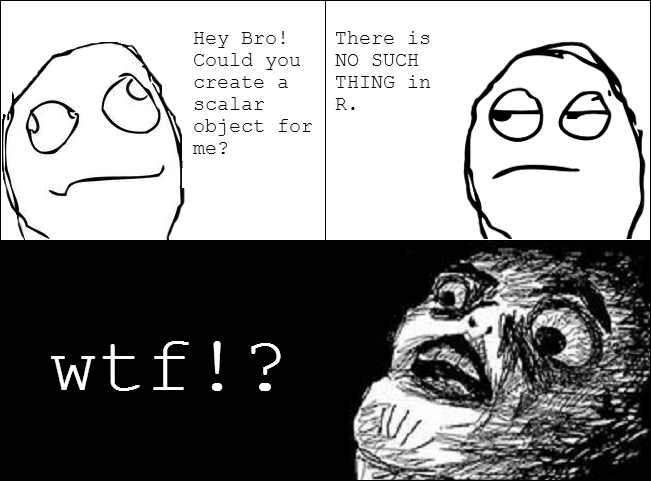
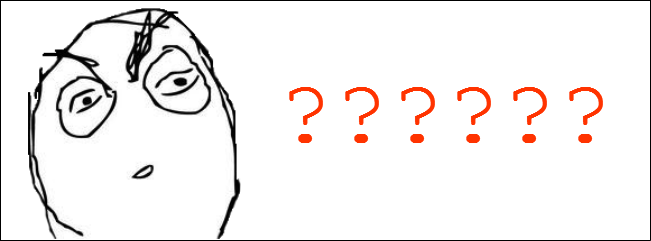
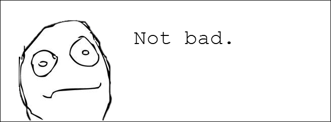
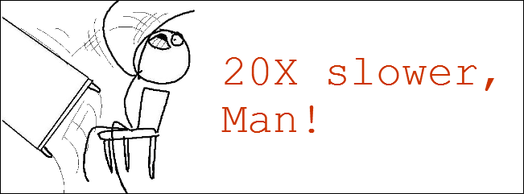
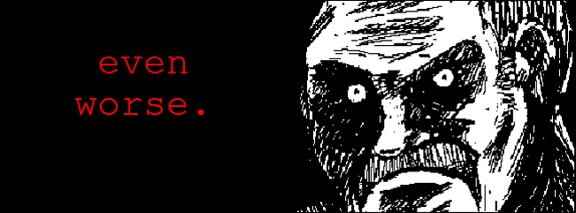
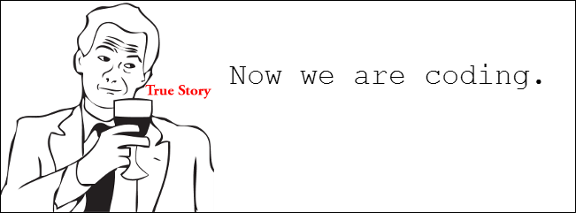
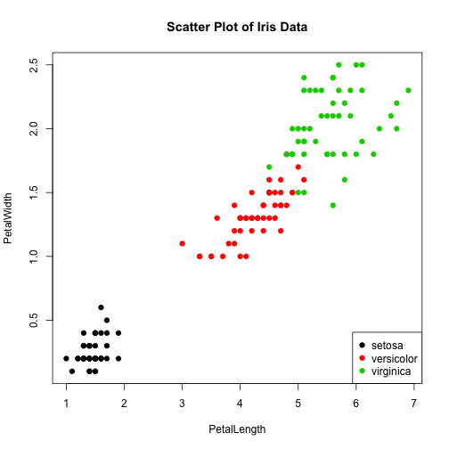
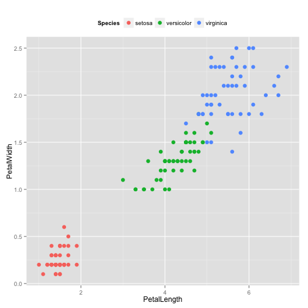

<style type="text/css"> 
    .small-code pre code { 
        font-size: 1.3em; 
    } 
</style>

Introduction to R
========================================================
author: Kyle Chung
date: November 28th, 2013 at Trend Micro
width: 1366
height: 768
font-family: 'Consolas'
transition: rotate
transition-speed: fast
incremental: false
navigation: section

Outline
========================================================
+ About me
+ What is R?
+ [Installation and IDE](#/section_ide)
+ [Basic Programming Tips in R](#/section_programming)
    + [Fundamentals](#/section_fundamentals)
    + [Type and Class](#/section_typeclass)
    + [Control Strucure](#/section_control)
    + [Function](#/section_function)
+ [I/O](#/section_io)
+ [Visualization](#/section_visualization)
+ [Final Remarks](#/section_remarks)

About Me
========================================================
left: 25%

<small>illust. by [RedEyeHare](http://redeyehare.tumblr.com/)</small>

[*> My LinkedIn*](http://www.linkedin.com/pub/kyle-chung/59/b34/32)

***

+ Career
    + Now: **SPN Data Correlation, Trend Micro**
    + <small>Former: Data Mining Programmer at Newegg.com</small>
+ Academic Background
    + Master of Economics, NTU
    + Bachelor of International Business, NCCU
        + <small>Double Major Accounting</small>
+ Skills
    + Econometrics, Data Mining, or *something like that*...

And then, about R...
========================================================
type: section

What is R? 
========================================================
type: sub-section
>

R: The most powerful statistical package
========================================================
incremental: true
+ A *general* programming language that is...
    + interpreted
    + designed for statistics
    + with a powerful and active academic community
    + able to run in both interactive and batch mode
    + applicaple to all modern operating systems
    + FREE! (open source)
+ Some useRs consider it *general* due to its high flexibility to develop applications for integration with other infrastructures...
    + ODBC with in-line SQL
    + high-level functions to deal with curl, json, XML...
    + Hadoop integration
    + And many others

Some History
========================================================
incremental: true
+ R is a GNU project based on S language, developed by AT&T (1976)
+ S was then sold (so there is S-PLUS)
+ Okay. That's it.

And why using R?
========================================================
type: sub-section
>

How about other languages?
========================================================
incremental: true
+ Among all over statistical packages such as...
    + **SAS** Extremely expensive with surprisingly little capability.
    + **SPSS** Not programmatically friendly. Not free.
    + **Stata** 
        + Powerful for economics and epidemiology
        + But with limited flexibility and scalability
        + Not free
    + **Matlab** Too fat. Not free.
    + **GAUSS**
        + <small>**G**eneral **A**pparatus for **U**sers to **S**uicide **S**ystematically (*I mean it.*)</small>

Installation
========================================================
type: sub-section
>

Let's Begin!
========================================================
+ For Windows
    + Download and execute the binary
+ For Mac
    + Download and execute the binary
+ For Linux, depending on the distribution...
    + `sudo apt-get install r-base-core`
    + `sudo yum install R-core` (recommend using EPEL)
    + Compile it on your own (don't look at me)
+ R on the cloud
    + [StatAce](http://statace.com/): A startup that allows you to conduct analysis on the cloud

Some Advices
========================================================
+ Choose 64-bit version whenever you can
    + R heavily depends on RAM
    + Some advanced applications only support 64-bit platform, e.g., RHadoop
+ Prefer Linux/Mac over Windows
    + There is a troublesome Unicode encoding issue in Windows not yet solved
        + if you are to analyze data coming from a variety of sources the world over, *you WILL be in trouble*
    + Some useful packages do not have pre-compiled version of or simply cannot run in Windows, e,g, `bigmemory`, `rPython`

IDE for R
========================================================
type: sub-section
id: section_ide
>

RStudio
========================================================
+ http://www.rstudio.com/
+ For all platforms
    + RStudio-Server for Linux server
+ Well integrated with Git
+ Markdown language interface customized for R
    + Slides for this lecture are purely writen in RStudio
+ Module used to develop web app of R based on interactive graphing
+ And yes, **it's FREE!**

IPython Notebook
========================================================
+ http://ipython.org/
+ Generally a Pyhton IDE
+ But you can easily execute R codes
    + try the magic function: `%load_ext rmagic`

Basic Programming Tips in R
========================================================
type: section
id: section_programming

Object-Oriented?
========================================================
type: prompt
> Your role matters!

+ In general, R is an OO language
+ As a software developer:
    + You write your application in OO style
    + You are possibly a contributor to CRAN
+ As a data analyst:
    + You hack into data with procedural or functional programming
    + You only need to know basic concept of OO
+ After all, it's up to you!
    + I personally never write OO-style codes for data analysis purpose

Fundamentals
========================================================
type: sub-section
id: section_fundamentals
>

Environment Setup #1
========================================================

```r
sessionInfo() # type ?sessionInfo for document help
```
+ Where is my working directory?

```r
getwd()
```
+ WIN users be careful: backslash path must be escaped

```r
setwd('C:\\Dropbox')
# or simply:
setwd('C:/Dropbox')
```
+ Save environment and quit

```r
save.image()  # default to destined file '.RData'
q()
```

Environment Setup #2
========================================================
+ Configure startup script

```r
edit(file='C:/Program Files/R/R-3.0.0/etc/Rprofile.site')
```
+ Get/set search paths for libraries (packages)

```r
.libPaths()
```

```
[1] "/Library/Frameworks/R.framework/Versions/3.1/Resources/library"
```

```r
(.libPaths(c(.libPaths(), getwd())))
```

```
[1] "/Library/Frameworks/R.framework/Versions/3.1/Resources/library"
[2] "/Users/kylechung/Dropbox/Rtraining/intro"                      
```

Misc
========================================================
+ R is *case-senstive*
+ Comment character is # only (no multi-line comment char)
+ In general, all objects are put into ram
    + Yes, there are exceptions
    + use `object.size` to check memory usage of object(s)
+ No line breaker required
    + Use semi-colon (;) to put multiple statements on one line
+ Use `gc` for garbage collection
    + In general R will handle this automatically
+ Use `library` or `require` to load external packages
+ Use `install.packages` to install CRAN packages
+ Use `as` function for type convertion

Assignment: '<-' versus '='
========================================================

```r
x <- 999L; y = 0 # append 'L' to force integer type
x                # the same as print(x)
```

```
[1] 999
```

```r
print(y)
```

```
[1] 0
```
+ Use '<-' for assignment
    + The Google R style guide indeed *prohibits* '=' as assignment
    + Better readability
+ Use '=' for parameter association (in function call)
    + Avoid unpredictable result

More on Assignment
========================================================
+ Parameter assignment is local-scoped when using '=', but not '<-'

```r
power2 <- function(z) z^2  
power2(z = 3); z           # Error: object 'z' not found
power2(z <- 4); z          # z is assigned numeric 4
```
+ What's more, due to **lazy evaluation**...

```r
z <- 'whatever remains'
tellTheTruth <- function(z) return(TRUE)
tellTheTruth(z <- 'I won\'t appear.')
```

```
[1] TRUE
```

```r
z
```

```
[1] "whatever remains"
```

Super Assignment: '<<-'
========================================================
+ Assign value globally within local function (What's the point?)

```r
changeX <- function(x) {
    x <- x + 100
    gvar <<- 'I am a GLOBAL variable.'
    x
}
x <- 0; changeX(x=x)
```

```
[1] 100
```

```r
x
```

```
[1] 0
```

```r
gvar
```

```
[1] "I am a GLOBAL variable."
```

Variables(Symbols) in R are...
========================================================
class: small-code
+ Not typed and without declaration

```r
x <- 123
typeof(x)
```

```
[1] "double"
```

```r
x <- 'abc'
typeof(x)
```

```
[1] "character"
```

```r
rm(x)     # remove the object
```

***

+ Lazily evaluated (already mentioned!)

```r
y <- x <- 'abc'
identical(tracemem(x), tracemem(y))
```

```
[1] TRUE
```

```r
y <- 'abc'
identical(tracemem(x), tracemem(y))
```

```
[1] FALSE
```

```r
identical(x, y)
```

```
[1] TRUE
```

Type and Class
========================================================
type: sub-section
id: section_typeclass
>

+ Types (of Vectors)
+ Matrices
+ Lists
+ Data Frames
+ Factors

Everything shall begin from a scalar!
========================================================


Everything shall begin from a vector...
========================================================
+ Oops! There is no such thing called *scalar* in R
+ The fundemantal building block is **vector**
    + 1L is an *integer vector of length 1*
    + *Matrices* are vectors
    + *Arrays* (multidimensional Matrices) are vectors
+ Index is 1-based

```r
V <- c(10L,20,30)   # c for concatenate
typeof(V)           # notice for the implicit casting
```

```
[1] "double"
```

```r
V[2]                # try ?'['
```

```
[1] 20
```

Types
========================================================
+ Types include...
    + logical `TRUE, FALSE, T, F`
    + integer, double, complex
    + character
    + list
    + closure, special, builtin (these are *functions*)
    + NULL
    + ...
+ Use `typeof` or `mode` to check the variable type
    + Difference? See `?mode`

Type v.s. Class
========================================================
type: prompt
+ Every object has a mode(type) and a class
    + Mode suggests how it is stored in memory
    + Class suggest its abstract type (utilized in OOP)


```r
x <- integer()
c(typeof(x), class(x))           # try also storage.mode(x)
```

```
[1] "integer" "integer"
```

```r
y <- data.frame()
c(typeof(y), class(y))
```

```
[1] "list"       "data.frame"
```

Vectors
========================================================
+ **Elements of a (atomic) vector must be all of the same type**

```r
(mixed <- c('123', 123)) # implicit casting
```

```
[1] "123" "123"
```
+ No insertion or deletion

```r
(mixed <- c(mixed, 4000)[2:4])   # V points to a new vector
```

```
[1] "123"  "4000" NA    
```
+ Can be named

```r
names(mixed) <- c('1st', '2nd', '3rd'); mixed
```

```
   1st    2nd    3rd 
 "123" "4000"     NA 
```

Recycling
========================================================
type: prompt
+ Operation that requires equal-lengthed vectors generally cause R to recycle the short one to necessary length

```r
c(1,2) * c(100,100,100) # '*' is element-wise, see ?'*'
```

```
Warning: longer object length is not a multiple of shorter object length
```

```
[1] 100 200 100
```
+ Apply to Matrices as well (Matrices *are* vectors)
    + Matrices are expanded to vectors by column

Matrix Multiplication
========================================================
+ Implemented by `%*%`
+ No recycling: non-comfortables will generate ERROR

```r
c(1,2,3) %*% c(100,100,100) # inner product
```

```
     [,1]
[1,]  600
```

```r
c(1,2,3) %o% c(100,100,100) # outer product
```

```
     [,1] [,2] [,3]
[1,]  100  100  100
[2,]  200  200  200
[3,]  300  300  300
```

Indexing #1
========================================================
+ Vector indexing is done by vector

```r
V <- c(10,20,30,40)
V[c(2,4)]
```

```
[1] 20 40
```

```r
V[2:length(V)]    # see ?seq for a generalized ':' function
```

```
[1] 20 30 40
```

```r
bool_index <- c(TRUE,FALSE,FALSE,FALSE)
V[bool_index]
```

```
[1] 10
```

Indexing #2
========================================================

```r
V1 <- c(10,20,30,40)
(V2 <- V1[c(rep(1,2),2:4)])  # take the 1st element twice
```

```
[1] 10 10 20 30 40
```

```r
V2[-c(2,4)]                  # negative indexing
```

```
[1] 10 20 40
```
+ Application?

```r
V2[V2 > mean(V2)]            # indeed, '>'(V2, mean(V2))
```

```
[1] 30 40
```

Indexing #3
========================================================
+ Can be done by names (if any)

```r
names(V1) <- c('one', 'two', 'three', 'four')
str(V1) # a very useful function to check structure of an object
```

```
 Named num [1:4] 10 20 30 40
 - attr(*, "names")= chr [1:4] "one" "two" "three" "four"
```

```r
V1[c('two', 'three')]
```

```
  two three 
   20    30 
```

```r
V1[grep('^t', names(V1))]   # see also ?grepl and ?regex
```

```
  two three 
   20    30 
```

Matrices #1
========================================================
+ A new class: vectors with additional attribute 'dimension'

```r
(M <- matrix(c(1,2,3,4), nrow=2, byrow=FALSE))
```

```
     [,1] [,2]
[1,]    1    3
[2,]    2    4
```

```r
str(M)           # simply a numeric vector with 2 dimensions
```

```
 num [1:2, 1:2] 1 2 3 4
```

```r
dim(M)           # try length(M)
```

```
[1] 2 2
```

Matrices #2
========================================================
+ Can be named on either rows or columns

```r
colnames(M) <- c('c1', 'c2')
rownames(M) <- c('r1', 'r2')
```
+ Indexed

```r
identical(M[,2], M[1:2,'c2']) # test exact equality
```

```
[1] TRUE
```
+ Editted

```r
M[1,1] <- 0; M
```

```
   c1 c2
r1  0  3
r2  2  4
```

Matrices #3
========================================================
+ Be careful! By default R will drop dimension when possible

```r
dim(M[1,])
```

```
NULL
```

```r
str(M[1,])             # rowname attribute is dropped, too
```

```
 Named num [1:2] 0 3
 - attr(*, "names")= chr [1:2] "c1" "c2"
```

```r
str(M[1,,drop=FALSE])  # you'll need this one day
```

```
 num [1, 1:2] 0 3
 - attr(*, "dimnames")=List of 2
  ..$ : chr "r1"
  ..$ : chr [1:2] "c1" "c2"
```

Matrices #4
========================================================
+ Append by `cbind` or `rbind`

```r
M1 <- matrix(1:4, 2, 2)       # use positional argument
M2 <- matrix(0, 2, 2)         # recycle occurs
cbind(M1, M2)
```

```
     [,1] [,2] [,3] [,4]
[1,]    1    3    0    0
[2,]    2    4    0    0
```

```r
unique.matrix(rbind(M1, M2))  # distinct by row
```

```
     [,1] [,2]
[1,]    1    3
[2,]    2    4
[3,]    0    0
```

Sparse Matrix
========================================================
type: prompt
> There are many implementations of sparse matrix in R. The base package `Matrix` provide a fairly flexible class `dgCMatrix` (which, of course, extends class `matrix`).

+ A document example

```r
i <- c(1,3:8); j <- c(2,9,6:10); x <- 7 * (1:7)
(A <- Matrix::sparseMatrix(i, j, x = x))
```

```
8 x 10 sparse Matrix of class "dgCMatrix"
                             
[1,] . 7 . . .  .  .  .  .  .
[2,] . . . . .  .  .  .  .  .
[3,] . . . . .  .  .  . 14  .
[4,] . . . . . 21  .  .  .  .
[5,] . . . . .  . 28  .  .  .
[6,] . . . . .  .  . 35  .  .
[7,] . . . . .  .  .  . 42  .
[8,] . . . . .  .  .  .  . 49
```

Lists #1
========================================================
+ Similar to dict in Python
+ Still vectors, but **recursive** (contrary to **atomic**)
    + Can contain elements of different types

```r
mylist <- list(name='Kyle', gender='male', 18)
str(mylist)         # notice that tag name is not required
```

```
List of 3
 $ name  : chr "Kyle"
 $ gender: chr "male"
 $       : num 18
```
+ Nesting is possible
    + Notice that this is why the name *recursive*

```r
nested <- list(old=mylist, new='new')
```

Recursive v.s. Atomic Vectors
========================================================
type: prompt
+ Atomic vectors can't be broken down, and can't have multiple types in its elements
    + numeric, character, logical, ...

```r
(atomic <- c(c(1,2,3), 4, 5))              # no nesting
```

```
[1] 1 2 3 4 5
```
+ Not the case for recursive vectors

```r
str(recursive <- list(list('a',2), TRUE))
```

```
List of 2
 $ :List of 2
  ..$ : chr "a"
  ..$ : num 2
 $ : logi TRUE
```

Lists #2
========================================================
+ List indexing: take individual element

```r
c(
    mylist$name,      # use '$' operator
    mylist[['name']], # use '[[' with tag name
    mylist[[1]]       # use '[[' with numeric index
    )
```

```
[1] "Kyle" "Kyle" "Kyle"
```
+ List indexing: slicing (always return a list)

```r
mylist[1:2]           # try also mylist[c('name', 'gender')]
```

```
$name
[1] "Kyle"

$gender
[1] "male"
```

Lists #3
========================================================
+ Insertion and deletion made possible!

```r
mylist$newtag <- 'something new'
mylist[[3]] <- NULL
mylist[['gender']] <- 'female'
mylist
```

```
$name
[1] "Kyle"

$gender
[1] "female"

$newtag
[1] "something new"
```
+ Use `unlist` to convert recursive vectors into atomic one

Data Frames #1
========================================================
class: small-code
+ Indeed lists; hence (recursive) vectors

```r
extends('data.frame') # return superclass of data.frame
```

```
[1] "data.frame" "list"       "oldClass"   "vector"    
```
+ To model *tabular* data
    + <small>`DataFrames` class from the `pandas` package in Python?</small>
    + <small>Yes it is designed to mimic data.frame in R</small>

```r
DF <- data.frame(small=letters, big=toupper(letters), rn=round(runif(26),1))
head(DF) # print the first 6 rows
```

```
  small big  rn
1     a   A 0.3
2     b   B 0.8
3     c   C 0.4
4     d   D 0.1
5     e   E 0.4
6     f   F 0.5
```

Data Frames #2
========================================================
+ Join
    + use `merge` for inner/outter join
+ Append
    + use `rbind`, `cbind` (these functions are *polymorphic*)
+ Aggregate (group-by operation)
    + use `aggregate`, `sweep`
+ Pivot
    + use `reshape`
+ Partition
    + use `split.data.frame`
+ Order-by
    + use `order`

Data Tables
========================================================
type: prompt
> Package `data.table` provides a new class 'data.table' which extends 'data.frame' but with more efficient computing capability for fairly large dataset.

+ Specifically, it provides:
    + Indexed data frame with binary search implemented
    + by-reference data manipulation
    + fast group-by operator
+ See [quick introduction](http://cran.r-project.org/web/packages/data.table/vignettes/datatable-intro.pdf) for more info

Factors #1
========================================================
+ To model nominal or categorical data
    + Yes, they are vectors
    + Seemingly character, but numeric

```r
(fchar <- factor(sample(letters[1:5], 5, replace=TRUE)))
```

```
[1] e e d d b
Levels: b d e
```

```r
c(class(fchar), typeof(fchar))
```

```
[1] "factor"  "integer"
```

```r
str(fchar)
```

```
 Factor w/ 3 levels "b","d","e": 3 3 2 2 1
```

Factors #2
========================================================

```r
x <- factor(c(1, 10, 100, 10))
levels(x)
```

```
[1] "1"   "10"  "100"
```

```r
as.character(x)
```

```
[1] "1"   "10"  "100" "10" 
```

```r
as.numeric(x)
```

```
[1] 1 2 3 2
```

```r
grep('00', x)    # grep use implicit casting
```

```
[1] 3
```

NULL
========================================================
+ Not exist, has no mode (or mode of its own)
+ Not to confused with `NA`, which represents missing values

```r
c(length(NA), length(NULL))
```

```
[1] 1 0
```
+ Not to confused with `NaN`, which represents not-a-number

```r
0/0
```

```
[1] NaN
```

Control Structure
========================================================
type: sub-section
id: section_control
>

+ if-else
+ repeat
+ while
+ for
+ try

Conditioning
========================================================
+ Syntax

```r
if (expression_A) {
    code_block_A
} else if (expression_B) {
    code_block_B
} else {
    code_block_C
}
```
+ Vectorized version: `ifelse`

```r
x <- c(1, 2, 3)
ifelse(x > mean(x), 'Yes', 'NO')
```

```
[1] "NO"  "NO"  "Yes"
```

Boolean Operators
========================================================
type:prompt
+ Be aware of the difference between:
    + Element-wise AND/OR: `&` and `|`
    + *Scalar* AND/OR: `&&` and `||`

```r
x <- c(1, 0, 1, 1)
y <- c(1, 0, 0, 0)
x & y             # return Boolean vector
```

```
[1]  TRUE FALSE FALSE FALSE
```

```r
x && y            # only the FIRST element is tested
```

```
[1] TRUE
```
+ Reminder: *non-zero* numerics are casted as `TRUE`
    + `if (1) print(TRUE)` is valid (not for Java you know...)

Looping: repeat
========================================================

```r
i <- 1
repeat {
    i <- i + 1
    if (i > 10) break
}
i
```

```
[1] 11
```
+ Simply a `while (TRUE)` loop
+ Escape keywords:
    + `next` to skip the current iteration
    + `break` to break the entire loop
+ Not required for indent but recommended
+ `{}` is required for multi-line block

Looping: while
========================================================

```r
i <- 1
while (i < 10) {
    i <- i + 1
}
i
```

```
[1] 10
```
+ Check the condition at *the begining* of each iteration
+ There is no 'until' loop in R

Looping: for
========================================================
+ Iterate over numeric/character vector

```r
for (i in 1:10) print(i)                 # result not printed
for (c in letters) print(c)
```
+ Iterate over a list of objects: use `get`

```r
A <- c(1, 2, 3)
B <- c(100, 200, 300)
for (obj in c('A', 'B')) print(mean(get(obj)))
```

```
[1] 2
[1] 200
```
+ Iterate over a list of objects: put object into a list

```r
for (obj in list(A,B)) print(mean(obj))  # result not printed
```

Exception Handling in R
========================================================
class: small-code
id: section_error_handling
> [You may want to see the section for Function](#/section_function) first!

+ Not programmingly friendly compared to other language
    + Not a statement-like format
+ Use `try` for simple application
+ Use `tryCatch` for more flexible and formal usage


```r
result <- 
    tryCatch({
        # main expression block
        # last valuated expression will be returned in case of success
    }, warning=function(cond) {
        # warning handling block, wrapped in function
        # argument is a condition class auto-generated in case of warning
    }, error=function(cond) {
        # error handling block, wrapped in function
        # argument is a condition class auto-generated in case of error
    }, finally={
        # the finally block that always evaluated
    })
```

Exception Handling: Toy Example #1
========================================================
class: small-code


```r
expr <- quote(1 + '1')

out <- tryCatch({
    eval(expr)
}, error=function(cond) {
    # simply return the condition object
    cond 
}, finally={
    # be ware that the finally block is NOT wrapped in function
    print('Finally!')
})
```

```
[1] "Finally!"
```

```r
out
```

```
<simpleError in 1 + "1": non-numeric argument to binary operator>
```

```r
class(out)
```

```
[1] "simpleError" "error"       "condition"  
```

Exception Handling: Toy Example #2
========================================================
class: small-code


```r
try_list <- list(expr1=quote(1 + 1), expr2=quote(1 + '1'))
sapply(try_list, eval)
```

```
Error: non-numeric argument to binary operator
```

```r
tryEval <- function(expr) {
    out <- tryCatch({
        eval(expr)
    }, error=function(cond) {
        message('the original error message:', '\n', cond)
        return(NA)
    })
    out
}
sapply(try_list, tryEval)
```

```
the original error message:
Error in 1 + "1": non-numeric argument to binary operator
```

```
expr1 expr2 
    2    NA 
```

Function
========================================================
type: sub-section
id: section_function
> 

Nothing more than a specific typed object, but deserve its own section cause it is the core of R programming.

<small>[Or skip to next section](#/section_vectorization)</small>

Basic Syntax of Function #1
========================================================

```r
doSomething <- function(x) {
    x    # this is the same as return(x)
}
```
+ `function` itself is a function object to create function
    + Actually, `{` is a function, too
        + Try `?'{'`
+ Formal name: **closure**
    + consisting of arguments, body, and its environment (scope)

```r
environment(doSomething)
```

```
<environment: R_GlobalEnv>
```
+ Use `ls` to list all variables in global (default) scope

Basic Syntax of Function #2
========================================================
+ `return` is not require
    + the function will by default return the last object in body code, and only the last one
        + use list to return multiple objects
    + use `return` for a conditional break
    + or use `stop` to break the function with error message
    + and use `warning` to generate warning message
    

```r
justInteger <- function(x) 
    if ( !is.integer(x) ) stop('please give me integer')
justInteger(1L)
justInteger('1')
```

```
Error: please give me integer
```

Function Nested
========================================================
+ It is possilbe (and sometimes desirable) to write a function within a function
    + This results in scope hierarchy
    + Inner-most scope have highest priority
+ Functions have no side effect
    + Only local copies will be changed
    + You can NOT change a variable in-place
    + A reminder: there are no *pointer* things in base R
        + variables are *copied by assignment*
        + but with *lazy evaluation*

So...
========================================================
type: prompt
incremental: true
class: small-code
<small>What do you think about the follwing prgramming fact in R?</small>


```r
V1 <- c(10,20,30,40); names(V1)
```

```
NULL
```

```r
names(V1) <- c('one', 'two', 'three', 'four'); V1
```

```
  one   two three  four 
   10    20    30    40 
```
<small>Apparently `names` is a function, and we **assign values to the result of its call**</small>
+ 

In fact..
========================================================
type: prompt
+  Try `?'names<-'` and `mode(get('names<-'))`


```r
V1 <- c(10,20,30,40)
V1 <- 'names<-'(V1, value=c('one', 'two', 'three', 'four'))
V1
```

```
  one   two three  four 
   10    20    30    40 
```

+ There are something called **replacement functions** in R
+ Remember this?
    + `V1[1] <- 11` will replace the first element of V1 with numeric 11
    + Indeed: try ?'[<-'
    + Also: `'$<-'` for list operation

Polymorphism
========================================================
class: small-code
+ The same function call leads to different operations for objects of different classes
    + Bulit-in function such as `plot`, `print`, `summary`, and many others are polymorphic
    + These functions are named *generic* funcitons in document
    + Use `methods` to query applicaple classes for a given generic function


```r
methods(summary)[1:20] # restrict to first 20 methods
```

```
 [1] "summary.aov"        "summary.aovlist"    "summary.aspell"    
 [4] "summary.connection" "summary.data.frame" "summary.Date"      
 [7] "summary.default"    "summary.ecdf"       "summary.factor"    
[10] "summary.ggplot"     "summary.glm"        "summary.infl"      
[13] "summary.lm"         "summary.loess"      "summary.loglm"     
[16] "summary.manova"     "summary.matrix"     "summary.mlm"       
[19] "summary.negbin"     "summary.nls"       
```

Polymorphism: An Example
========================================================
class: small-code


```r
# reduce sample dataset
iris1 <- iris[,1:2]

# linear regression without intercept
lm_model <- 
    lm(data=iris1, 
       Sepal.Length~ -1+Sepal.Width)

# summarize a data.frame
summary(iris1) 
```

```
  Sepal.Length   Sepal.Width  
 Min.   :4.30   Min.   :2.00  
 1st Qu.:5.10   1st Qu.:2.80  
 Median :5.80   Median :3.00  
 Mean   :5.84   Mean   :3.06  
 3rd Qu.:6.40   3rd Qu.:3.30  
 Max.   :7.90   Max.   :4.40  
```

***


```r
summary(lm_model)
```

```

Call:
lm(formula = Sepal.Length ~ -1 + Sepal.Width, data = iris1)

Residuals:
   Min     1Q Median     3Q    Max 
-2.524 -1.036  0.482  0.990  2.841 

Coefficients:
            Estimate Std. Error t value Pr(>|t|)    
Sepal.Width   1.8690     0.0326    57.2   <2e-16 ***
---
Signif. codes:  0 '***' 0.001 '**' 0.01 '*' 0.05 '.' 0.1 ' ' 1

Residual standard error: 1.23 on 149 degrees of freedom
Multiple R-squared:  0.957,	Adjusted R-squared:  0.956 
F-statistic: 3.28e+03 on 1 and 149 DF,  p-value: <2e-16
```

The 'Apply' Function Family
========================================================
+ Highly readable
+ Ready for parallelization
+ No side effect (compared to explicit loop)
+ Useful members:
    + `apply`
        + Apply a function to each row/column of a matrix
    + `lapply`
        + Apply a function to each element of a list
        + Use `sapply` for a vector version
    + `mapply`
        + Apply a function with each parameter given in a vector
    + And many others

Example for 'apply'
========================================================
class: small-code

```r
(M <- matrix(sample(1:15), 3, 5))
```

```
     [,1] [,2] [,3] [,4] [,5]
[1,]   10   13   15    5   12
[2,]    9    1    4    7    2
[3,]   11    6   14    8    3
```

```r
apply(M, 2, mean)
```

```
[1] 10.000  6.667 11.000  6.667  5.667
```

```r
apply(M, 2, function(x) sum(x)/length(x)) # use anonymous function
```

```
[1] 10.000  6.667 11.000  6.667  5.667
```

```r
# Indeed we have...
colMeans(M)
```

```
[1] 10.000  6.667 11.000  6.667  5.667
```

Example for 'lapply'
========================================================
class: small-code

```r
str(cars)  # remember that a data.frame is a list
```

```
'data.frame':	50 obs. of  2 variables:
 $ speed: num  4 4 7 7 8 9 10 10 10 11 ...
 $ dist : num  2 10 4 22 16 10 18 26 34 17 ...
```

```r
apply(cars, 2, mean)   # return a vector
```

```
speed  dist 
15.40 42.98 
```

```r
lapply(cars, mean)     # return a list
```

```
$speed
[1] 15.4

$dist
[1] 42.98
```

Final Remarks on Function
========================================================
+ Actually, all control-flow constructs are formed by functions

```r
c(mode(get('if')), mode(get('for')))
```

```
[1] "function" "function"
```
+ And all operators are functions, too

```r
c(mode(get('+')), mode(get('&&')), mode(get('<-')))
```

```
[1] "function" "function" "function"
```
+ Everything is an object, and many of them functions

```r
mode(get('{'))
```

```
[1] "function"
```

Time for Error Handling!
========================================================
type: alert
Now we shall go back to the [section for error handling](#/section_error_handling).

Vectorization
========================================================
type: prompt
id: section_vectorization
A function applied to a vector is actually applied to each element individually (i.e., A map function)
+ 'Apply' family functions are *NOT* vectorized
+ Most of the built-in operators are vectorized
+ The principle for writing loops in R:
    + *NOT* to write loops in R (whenever possible)
    + Use vectorization first
+ But why?
    + R interpreter is slow
    + Vectorization is implemented in C or Fortran (they're faster)
    + Side effects

Little Experiment on Vectorization
========================================================
type: prompt
incremental: true
+ Looping add in Python

```python
import time
mil = range(1, 1000001)
start_time = time.time()
mil = [m + 100 for m in mil]
print time.time() - start_time, 'seconds'
```

```
0.116131782532 seconds
```

+ 

Little Experiment on Vectorization
========================================================
type: prompt
incremental: true
+ Looping add in R

```r
mil <- c(1:1000000)
system.time( # explicit loop with side effect
    for ( i in seq_len(length(mil)) ) mil[i] <- mil[i] + 100
    )
```

```
   user  system elapsed 
  1.500   0.016   1.524 
```

+ 

Little Experiment on Vectorization
========================================================
type: prompt
incremental: true
+ Looping add in R (one more try!)

```r
mil <- c(1:1000000)
system.time( # high-level loop wraper without side effect
    mil <- sapply(mil, function(x) x + 100)
    )
```

```
   user  system elapsed 
  3.353   0.044   3.424 
```

+ 

Little Experiment on Vectorization
========================================================
type: prompt
incremental: true
+ Vectorized add in R

```r
mil <- c(1:10000000) # one more zero
system.time(         # What the hell are you two just doing?
    mil <- mil + 100
    )
```

```
   user  system elapsed 
  0.133   0.021   0.154 
```

+ 

I/O
========================================================
type: section
id: section_io

Here comes the data.


Basic Operation
========================================================
+ Commonly used functions include...(See `?files` for more)
    + `dir`: list files under the curent working directory
    + `file.info`: examine information of a given file
    + `file.exist`: check the existence of a file
+ Or simply use `system` to execute your system commmand
    + stdout will be redirected to R console
    + `system('ls')` is conceptually the same as `dir`
    + Limitation: pipes not allowed
+ Use `shell` for more flexible shell command

```r
dir()[grep('\\.html$', dir())]
# is the same as
shell('ls | grep "\\.html$"', intern=TRUE)
```

Low-Level Load Function: readLines()
========================================================
+ Read the source line-by-line into character vector
    + Source could be an external file or a connection
    + Connection can be established purely in R
    + Write to a file via `writeLines`


```r
temp_file <- file()
cat(
'this is the first line
and this is the second line
this is the end of file
', file=temp_file)   # be ware of the quoting position
readLines(temp_file) # connection will be auto-closed
```

```
[1] "this is the first line"      "and this is the second line"
[3] "this is the end of file"    
```

What is a "connection"?
========================================================
type: prompt

+ `?connection`
+ Connection in R document is used to describe the mechanism of I/O operation.
+ There are lots of different kind of connection:
    + a file connection established by `file`
    + a compressed file connection by `gzfile`
        + such taht you don't need to manually uncompress the data before analysis
    + a web page connection by `url`
        + analyze online content with other packages such as `XML`, `rjson`
    + many others

Low-Level Load Function: scan()
========================================================
+ More configurable than `readLines`
    + (Optionally) Use pre-defined schema to load and convert data type
    + Can parse structurally delimited raw data
+ The main function to establish high-level load function in R


```r
temp_file <- file()
cat('1,,three', file=temp_file)
scan(temp_file, what=list(col1=1L,col2=1L,col=''), sep=',')
```

```
$col1
[1] 1

$col2
[1] NA

$col
[1] "three"
```

High-Level Load Function: read.table()
========================================================
+ See `?read.table`
    + Many variants exist: `read.csv`, `read.fwf`, ...
+ Some parameter suggestions... 
    + use `nrows=100` to read the initial 100 rows for testing purpose
    + use `comment.char=''` to disable comment char if you are dealing with messy string data to prevent from long string crash
    + use `stringsAsFactors=FALSE` if you don't like characters to be converted into factors
    + use `colClasses` to pre-defined data schema for speedup
    + use `fill=TRUE` if your data is unbalanced (have missing columns for some rows)
+ The returned object is `data.frame`

Visualization
========================================================
type: section
id: section_visualization
There are a bunch of ways to do data visualization in R, with either base environment or leveraing other add-on pacakges and even other languages-- for example, JavaScript.

Static Graphing
========================================================
type: sub-section
> 

High-Level Graphing
========================================================
+ Do visualiztion in R is kinda high-level stuff
    + We have `plot`, `barplot`, `boxplot`, `matplot`, ...
        + `plot` is a generic function doing X-Y ploting
        + `barplot` is used to generate barplot (what else?)
        + `boxplot` for boxplot
        + `matplot` for multi-line ploting
        + and still others, e.g., `rgl::plot3d`
    + These are mainly built-in graphing functions
    + Many advanced add-on packages available

An Example: Scatter Plot
========================================================
+ Let's generate some sample data to plot!

```r
case <- iris[,3:5]
colnames(case) = gsub('\\.', '', colnames(case))
case$Name <- paste('N', 
                   round(runif(nrow(case)),3)*1000, 
                   sep='')
head(case)
```

```
  PetalLength PetalWidth Species Name
1         1.4        0.2  setosa N952
2         1.4        0.2  setosa  N76
3         1.3        0.2  setosa N833
4         1.5        0.2  setosa  N73
5         1.4        0.2  setosa N728
6         1.7        0.4  setosa N141
```

An Example: Scatter Plot (by Base)
========================================================
class: small-code

```r
plot(x=case$PetalLength,
     y=case$PetalWidth,
     xlab='PetalLength',
     ylab='PetalWidth',
     col=c(1:3)[case$Species], 
     pch=19)
legend('bottomright', 
       levels(case$Species), 
       col=c(1:3), pch=19)
title('Scatter Plot of Iris Data')
```
+ Problem in base package
    + Syntax and parameters inconsistent across types of plot
    + Hard to configure details
 
***

 

An Example: Scatter Plot (by ggplot2)
========================================================
class: small-code

```r
library(ggplot2)
AES <- aes(x=PetalLength, 
           y=PetalWidth, 
           group=Species, 
           color=Species)
ggplot(case, AES) + 
    geom_point(size=3) + 
    theme(legend.position='top')
```
+ Advantage of ggplot2
    + Syntax highly consistent across types of plot
    + Details are auto-adjusted with managable modifications
    + See more examples [here](https://github.com/everdark/datavis/blob/master/ggplot2_exercise.R)
    
***

 

Dynamic Graphing
========================================================
type: sub-section
>

Integration with JavaScript (Libraries)
========================================================
+ Possible solutions:
    1. Do data analysis in R, render graph by JS
        + `rcharts`, `d3network`, `googleVis`, ...
        + These packages provide high-level interface to graphing libraries outside R
    2. Do data analysis and graphing in R, add interactivity by JS
        + `gridSVG`, `SVGAnnotation`, ...
        + These packages provide high-level interface to JavaScript functionality
    3. Use web app devtool `shiny` ([a RStudio product](http://www.rstudio.com/shiny/))
+ Either case, automation done purely in R environment is possible
    + You may need some JS knowledge
    
Try Solution 1! Plot via NVD3
========================================================

```r
library(rCharts)
nvd3 <- nvd3Plot(
    PetalLength ~ PetalWidth, data=case, type='scatterChart', 
    group='Species', 
    xAxis=list(axisLabel='PetalWidth'), 
    yAxis=list(axisLabel='PetalLength'),
    chart=list(showDistX=TRUE, showDistY=TRUE)
); nvd3
```

<iframe style="width: 100%; height: 450px;" src="https://dl.dropboxusercontent.com/u/210177/R/datavis/demo/file12f044377a8.html" id="frameid"></iframe>

NVD3 with d3.js Modification
========================================================
<iframe style="width: 100%; height: 450px;" src="https://dl.dropboxusercontent.com/u/210177/R/datavis/demo/scatterChart_hacked.html" id="frameid"></iframe>

<small>
see [my RPubs article](http://rpubs.com/everdark/datavis) for the source code.
</small>

Try Solution 2! Render graph in R
========================================================
+ This time we create the plot by R device


```r
library(ggplot2)
library(gridSVG)
AES <- aes(x=PetalLength, 
           y=PetalWidth, 
           group=Species, 
           color=Species)
gg <- ggplot(case, AES) + 
    geom_point(size=3) + 
    theme(legend.position='top')
ggsvg <- grid.export("ggplot_scatter.html", 
                     xmldecl=NULL, addClasses=TRUE)
file.show('ggplot_scatter.html')
```

Convert grid-based graph to SVG format
========================================================
<iframe style="width: 100%; height: 500px;" src="https://dl.dropboxusercontent.com/u/210177/R/datavis/demo/ggplot_scatter.html" id="frameid"></iframe>

Zoom out to check scalability!

Hack .svg: Convert data to JSON 
========================================================
class: small-code


```r
# read back svg inline
raw_svgcode <- readLines('./svg_demo/ggplot_scatter.html', warn=FALSE)

# add d3.js library path
d3js_library_url <- 'https://dl.dropboxusercontent.com/u/210177/d3/d3.v3.min.js'
modified_svgcode <- c(paste('<script src="', 
                            d3js_library_url, 
                            '"></script>', 
                            sep=''), raw_svgcode)

# convert data to json (in object-of-objecs format)
head(gg$data)
tojson <- apply(gg$data, 1, function(x) list(x))
tfile <- file()
cat(
    '<script> data=',
    rjson::toJSON(lapply(tojson, function(x) unlist(x))),
    '</script>'
    ,
    file=tfile
    )
importData <- readLines(tfile, warn=FALSE)
close(tfile)
modified_svgcode <- c(modified_svgcode, importData)
```

Hack .svg: Bind data reversely
========================================================
class: small-code


```r
# bind data
tfile <- file()
cat(
    '
    <script>
    scatterpoints = d3.select(".points")
                      .selectAll("use")
                      .data(data);
    </script>
    ',
    file=tfile
    )
bindData <- readLines(tfile, warn=FALSE)
close(tfile)
modified_svgcode <- c(modified_svgcode, bindData)
```

Hack .svg: Add simple tooltip
========================================================
class: small-code


```r
# add simple tooltip (use browser default title facility)
tfile <- file()
cat(
    '
    <script>
    d3.selectAll("use")
      .append("title")
      .text(function(d) {return d.Name;});
    </script>
    ',
    file=tfile
)
addTooltip <- readLines(tfile, warn=FALSE)
close(tfile)
modified_svgcode <- c(modified_svgcode, addTooltip)
```

Hack .svg: Add hyperlink event
========================================================
class: small-code


```r
# add hyperlink event
tfile <- file()
cat(
    '
    <script>
    d3.selectAll("use")
      .on("click", function(d) {
        var url = "http://google.com/search?q=";
        url += d.Name;
        window.location.href = url;}
        );
    </script>
    ',
    file=tfile
)
addHref <- readLines(tfile, warn=FALSE)
close(tfile)
modified_svgcode <- c(modified_svgcode, addHref)

writeLines(modified_svgcode, './svg_demo/ggplot_scatter_modified.html')
file.show('./svg_demo/ggplot_scatter_modified.html')
```

Hack .svg: Done!
========================================================
<iframe style="width: 100%; height: 720px;" src="https://dl.dropboxusercontent.com/u/210177/R/datavis/demo/ggplot_scatter_modified.html" id="frameid"></iframe>

Final Remarks
========================================================
type: section
id: section_remarks

Some Useful Packages?
========================================================
+ On-disk computing
    + `ff`, `ffbase`, `sqldf`
+ Parallel computing
    + `parallel` for embarrassingly parallel problem
    + many others (including GPU computing)
+ Machine learning
    + `randomForest`, `arules`, `e1071`, ...
+ Database interface
    + `RODBC`
+ Hadoop
    + `rmr2`, `rhdfs`, `rhbase`, ...
+ See [CRAN task views](http://cran.r-project.org/web/views/) for more info

References
====================================
type: prompt
+ Chang (2013), *R Graphics Cookbook*
+ Matloff (2011), *The Art of R Programming*
+ Murray (2013), *Interactive Data Visualization for the Web*
